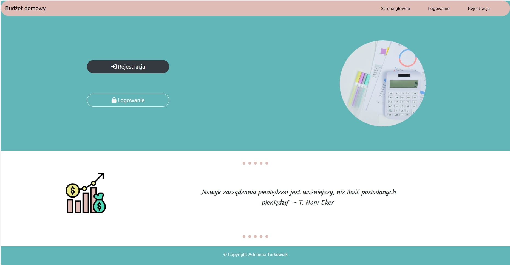
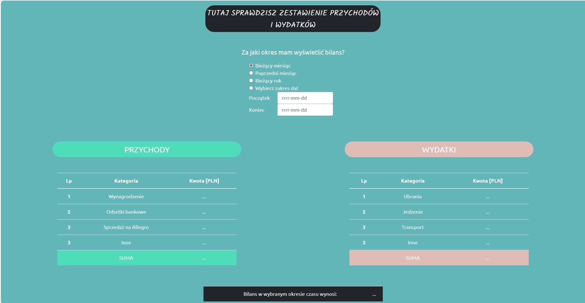
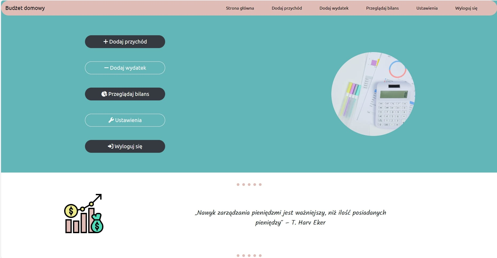
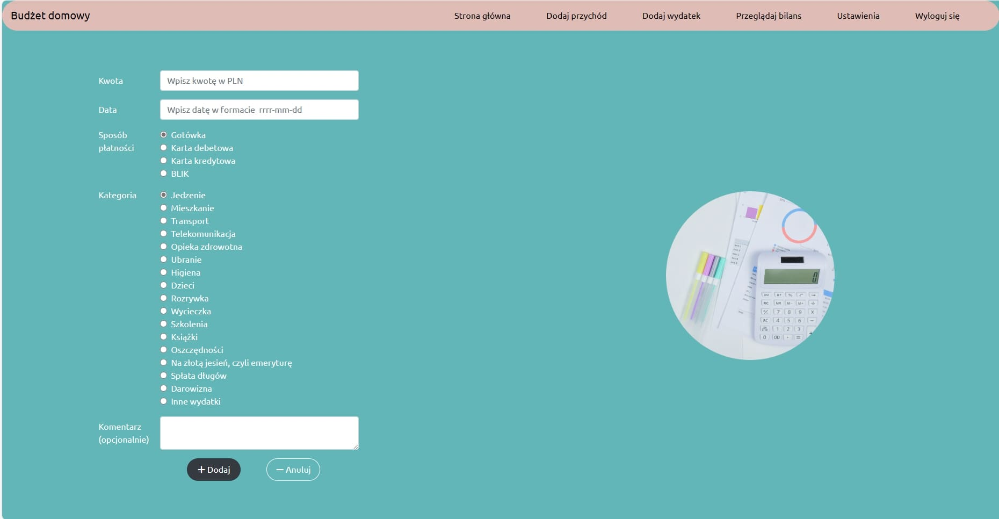
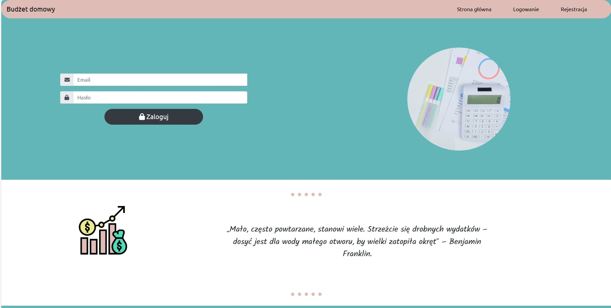
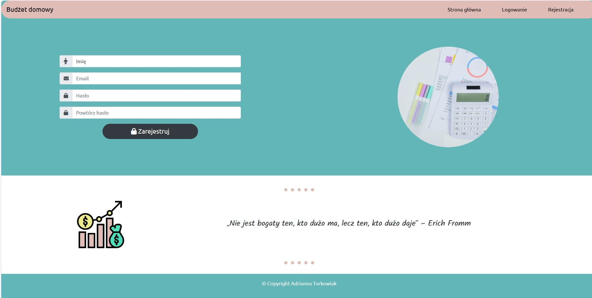

# Personnal_Budget_App

It's a program created to train HTML and CSS with Bootstrap

Features:

- registration and login
- adding incomes and expenses
- displaying all selected dates balance
- changing password of user

